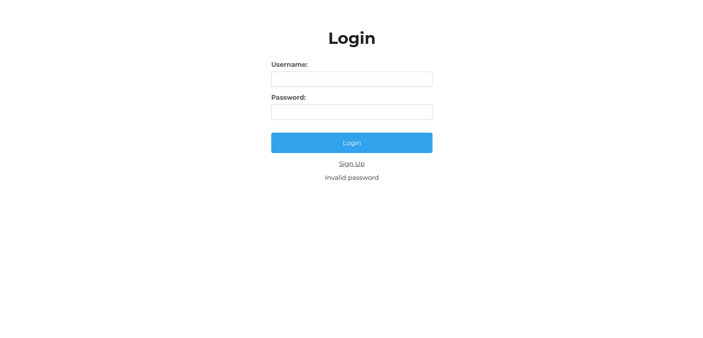
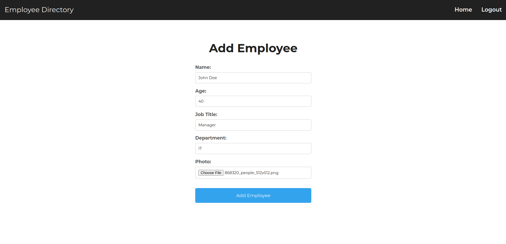
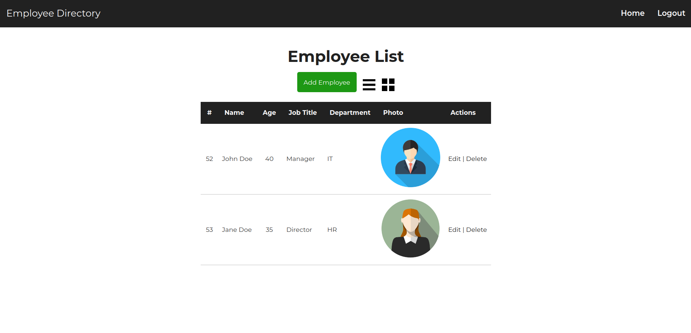

# Instructions
1. Import `migration.sql` file in phpMyAdmin
2. To make it possible to upload files, you need to make sure `file_uploads = On` in the `php.ini` file, and run the two following commands
(might depend on where you’ve stored the folder):


```
sudo chmod 755 /opt/lampp/htdocs/oblig3/uploads
sudo chown daemon:daemon /opt/lampp/htdocs/oblig3/uploads
```

# UI Overview





